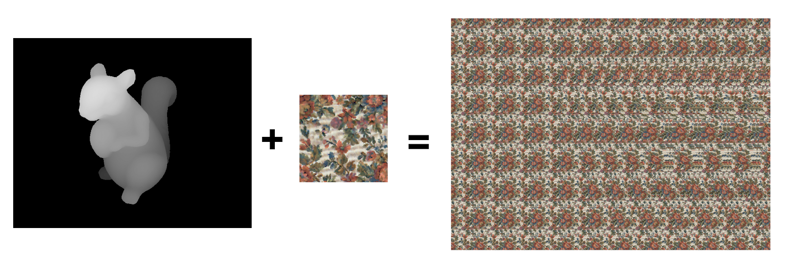
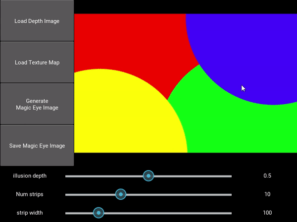
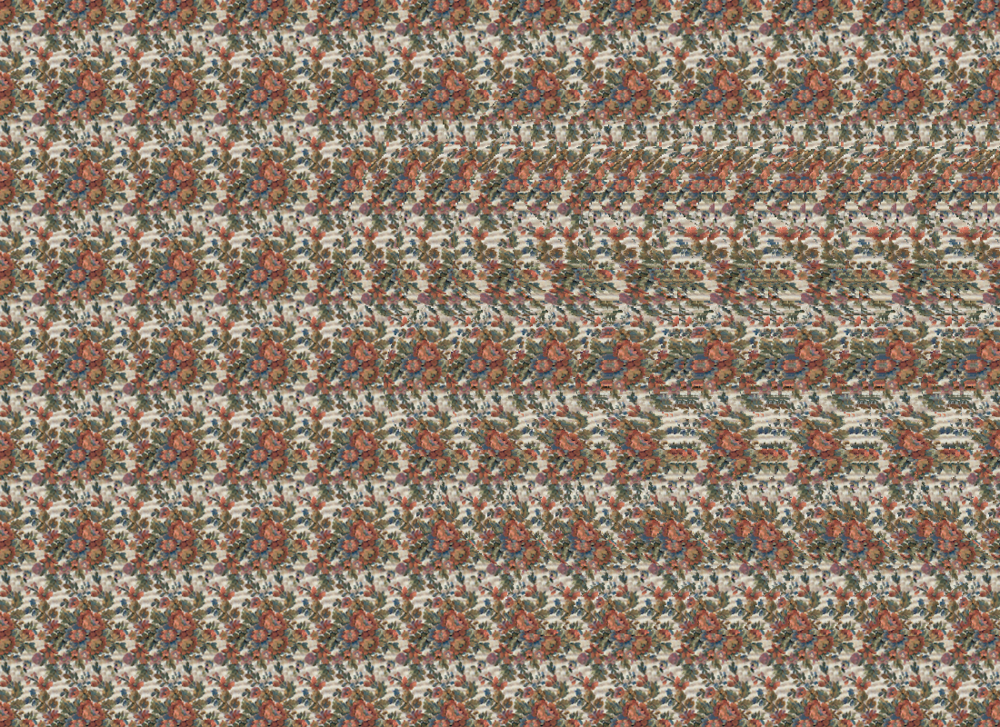

## MagicEyeGenerator
This project generates [magic eye](https://www.youtube.com/watch?v=v8O8Em_RPNg) illusion pictures with custom images and textures.  

### usage 
`python main.py` to load the kivy app  
- choose your depth map image (default files in data/depth_map folder)  
- choose your texture image (default files in data/texture folder) 
- run "generate magic eye" to generate image in memory
- change slider to adjust parameters if the illusion looks wonky
- save image to file   

  
output image zoomed  

This app also support gif depth map (experimental)

### installation
requires:  
Kivy (2.0.0rc2)  
numpy  
pillow

`python setup.py install`

### resources
#### stereogram resource
https://developer.nvidia.com/gpugems/gpugems/part-vi-beyond-triangles/chapter-41-real-time-stereograms

#### app related resources
https://kivy.org/doc/stable/examples/gen__canvas__texture__py.html

https://stackoverflow.com/a/52340135/4231985
